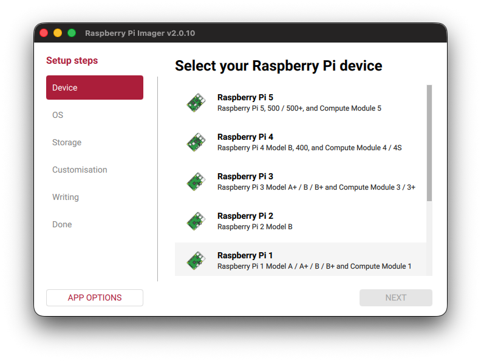
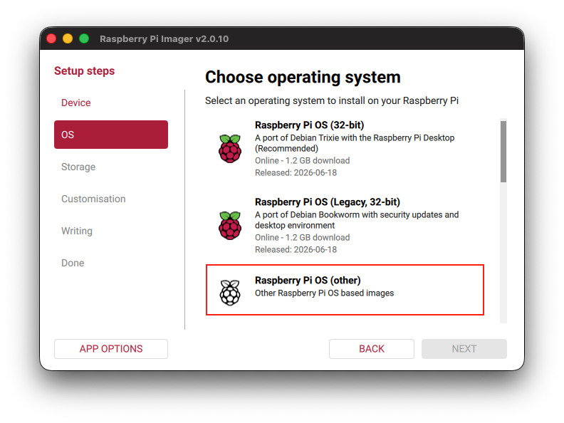
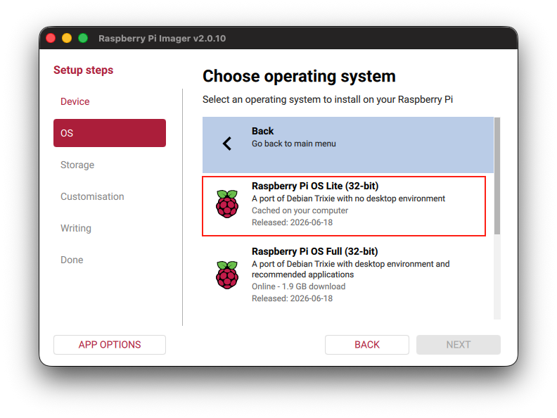
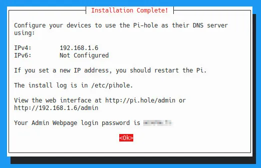
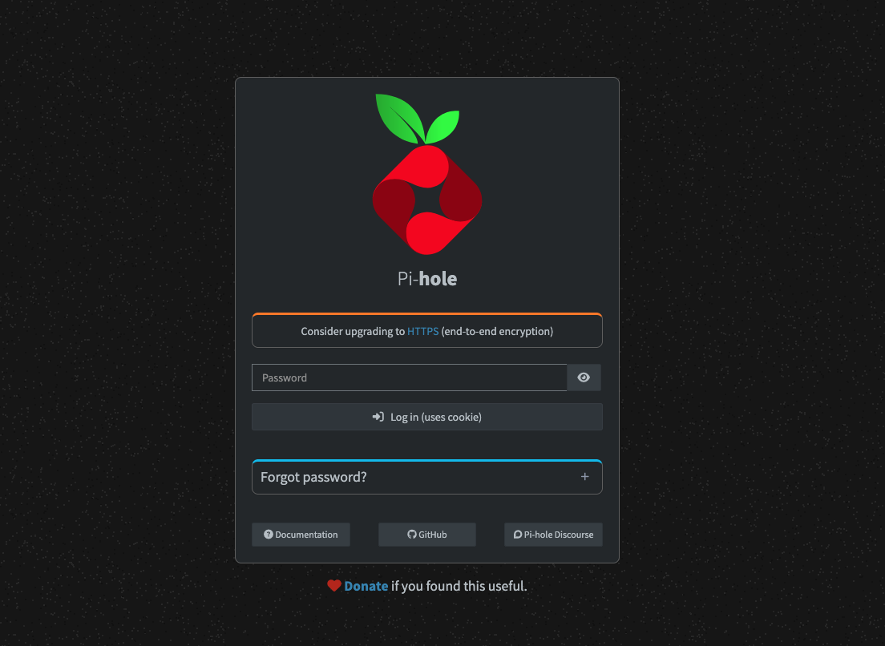
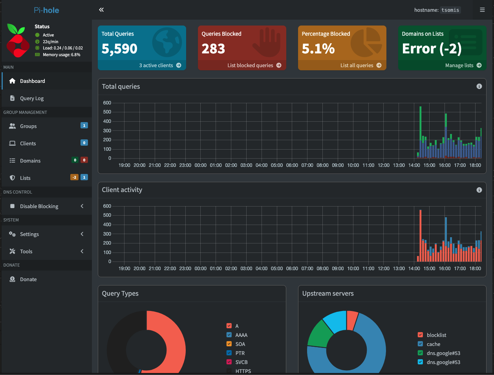
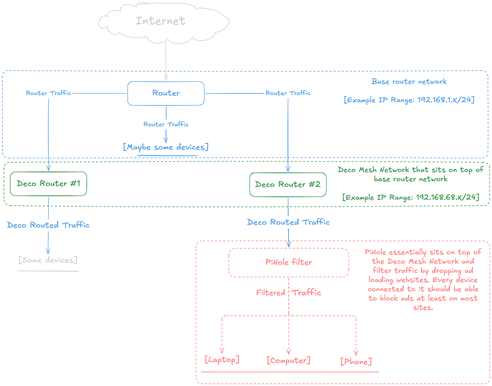

# PiHole-Setup
A guide on how to setup PiHole at home and host it on your Raspberry Pi. It also showcases my own journey with the mistakes I made (breaking stuff is the way. By the way) so that they can hopefully be avoided.

> ⚠️ **Disclaimer:** Breaking stuff is an essential part of learning! The steps outlined in this guide worked perfectly for my specific network setup, but I am not responsible for any accidental router resets, angry household members, or ghost IP configurations that may occur on your end. Proceed at your own risk!

### What is PiHole ?
PiHole is a software that sits on top of a network and basically filters ads. It is a **network-wide ad blocker**. It uses **lists of domains** that download or are related with ads so it can block them. There are some default lists but you can also add custom lists containing other domains.

### How to get started

* First you are going to need a **Raspberry Pi (obviously)**. Anything from as old as a Model 2b (which is what I have) up to a Model 5 will do. PiHole itself and the overall process is not heavy at all so even that 1GB of RAM that the Model 2b has is sufficient. 
* You obviously need **connection** to the **internet** either via WiFi Antenna (Model 2b does not a WiFi module so you will need an antenna) of the good old reliable Ethernet.
* In terms of power supply, a 20W phone charger should be enough to power it on, but if you want you can also use the old-fashioned DC power supply with the little circular cord thing (you know what I mean).
* An **SD Card** to write the operating system to. There might be ways to do it with a live USB stick, but with the SD card you can just write it once, insert it in the slot and just leave it there ( that does not apply if you break the system multiple times like I did and need to literally reinstall it because it is irreversible :( )
* If your laptop or computer that you use to flash the SD does not have a reader by itself, you will need an **SD Reader**.
* **Raspberry Pi Imager software** to write the Raspberry Pi OS into the SD Card. You can download it [here](https://www.raspberrypi.com/software/)

### Raspberry Pi Imager

Lets now look at the process regarding **Raspberry Pi Imager** to flash it.

1. You first have to select your Raspberry Pi Model.



2. Then you have to choose the Operating System that you want to flash. Now if you have something like the Model 2b and you only want to setup PiHole, I would recommend you ignore anything that has a desktop environment. I have tried it and the Raspberry Pi was getting super hot and I am not even going to consider talking about performance. If you have a better model that has the capacity of a desktop environment then you can go for it but for the purpose of this tutorial we will stick with n**o desktop environment**. Therefore I recommend going to the **other** section as shown below



Then choose **Raspberry Pi OS Lite (32-bit)**



3. After that you should see the listed SD Reader or the media that you will use to flash the OS to. Select it and press **"Next"**.
4. Then you go through the **customization phase** in which you set things like **username (remember it), password** and you configure **SSH**. When you come across **SSH Authentication**, keep it at **"Use password authentication"**. **Raspberry Pi Connect** is not needed.
5. After completing the configuration you let the program flash the OS and write it to the media and then when it finishes writing it will tell you that it is ready.

### Loading & Accessing the OS

Once the OS is written you can insert the media into the Raspberry Pi itself. Once inserted, let it **boot up** for about **2-3 minutes**.
The OS that we have selected in this tutorial has no desktop environment. In order to interact with the OS there are couple of ways. The most obvious one is hooking it up to a keyboard and a monitor. The other is what I did. I found the IP address of my Raspberry Pi and I just used SSH to log in to it. It is probably way easier than trying to hook it up to a monitor and doing all that work just for a terminal but it depends on the case.
You can find the IP address of the device by going into your **Router's gateway** where all the devices are listed. Keep the IP we will need it throughout almost the whole process.

>**Note:**
>I personally use a **Mesh network** which sits on top of my router network. If you want to get a better understanding of the layout and more technical stuff, check out the [network layout](#network-layout).

If you use Mesh devices or you have some sort of network that sits on top of your default router network, then you should be able to see it from the corresponding app that monitors the network. For example, if you use **Deco Mesh Devices**, Deco has an app where you see every connected device and you can see their IPs, manage them etc. The **main goal** is to find the IP of your Raspberry Pi.
After you find the IP of your device you can connect to it via SSH. In order to be sure that it is discoverable from your laptop, I like to do a nice `ping` first to see if I get a response. You can use the command `ping <your-ip-here>` and if you see a response like this:

```
64 bytes from <your-ip> .....
```

then the device is indeed visible. That gives us the green light that we can SSH to the device. Now in order to ssh to your device you can do:

```bash
ssh username@ip-address
```


If the **ssh command** is executed correctly, you will be prompted to accept that connection and the ED25519 key exchange thingy by typing **"yes"**. After typing yes you will be inside the Raspberry Pi's terminal.

If for some reason you have messed up something (definitely not what happened to me) and you get a message like this when attempting to connect:
```bash
@@@@@@@@@@@@@@@@@@@@@@@@@@@@@@@@@@@@@@@@@@@@@@@@@@@@@@@@@@@
@    WARNING: REMOTE HOST IDENTIFICATION HAS CHANGED!     @
@@@@@@@@@@@@@@@@@@@@@@@@@@@@@@@@@@@@@@@@@@@@@@@@@@@@@@@@@@@
IT IS POSSIBLE THAT SOMEONE IS DOING SOMETHING NASTY!
Someone could be eavesdropping on you right now (man-in-the-middle attack)!
It is also possible that a host key has just been changed.
The fingerprint for the RSA key sent by the remote host is
[...].
Please contact your system administrator.
Add correct host key in /home/sward/.ssh/known_hosts to get rid of this message.
Offending RSA key in /home/sward/.ssh/known_hosts:86
RSA host key for [...] has changed and you have requested strict checking.
Host key verification failed.
```

then you should look at [this section](#known-hosts-problem) that I made because it *(most certainly)* did not happen to me).

### PiHole Tool Installation
Now in order to install it I personally followed a YouTube tutorial. That is probably why it was so much more complicated than it is. The video in question was [this](https://www.youtube.com/watch?v=Z_sVjxu9LjE). It is a very good video and it gives you a very nice insight as to how you can do it in a different way using **Docker**. To be honest, for the average foe this is a bit complicated and things can get messy quite easily depending on the whole network setup.
A very much more reliable way of doing it is by executing this command found on the [official GitHub repository of PiHole](https://github.com/pi-hole/pi-hole/#one-step-automated-install:~:text=One%2DStep%20Automated%20Install)

```bash
curl -sSL https://install.pi-hole.net | bash
```

> **Note:**
> Initially it might fail because it needs `root` privileges. If it happens run this:
> ```bash
> curl -sSL https://install.pi-hole.net | sudo bash
> ```


Once you run the command, sit back, relax, **WATCH THE LOGS** in case something does not go as planned, and wait for it to finish installing.
Once it finishes installing there will be a screen inside the terminal that will tell you some important info like so:



There is a **URL** that is generated and a **password**.
The URL generated is obviously the Raspberry Pi's IP address followed by `/admin`. By typing the URL given to you on your browser, you will see a Web Interface that looks like this:



Use the **password that was generated** and type it or paste it into the field and **Voilà** you are in! The dashboard should look something like this:



At this point you have ultimately laid the foundation and have your ad-blocker ready. Now that does not do anything on its own obviously we have to hook some devices up and let it do it's job and filter stuff for us. So lets see how it is done in the **next section**.

### Bringing your Personal Devices into the loop (DNS Isolation)

Instead of forcing your **entire household** to use the Pi-hole through your router, you can 
configure your personal devices to talk to it directly. This keeps your lab environment completely isolated to just your phone and laptop.

Now in order for your device to receive that filtered traffic, we have to set our Raspberry Pi that we just have set up to be our DNS Server. This is easily done by tweaking each device's DNS settings (laptop, phone etc), and setting your IP of the Raspberry as the DNS server. Now depending on the operating system the way that you make that change can differ. So lets see how it is done in each one.

#### 1. macOS (Wi-Fi or LAN/Ethernet)
1. Open **System Settings** and look at the network sidebar:
   * If on Wi-Fi: Click **Wi-Fi**, then click the **Details...** button next to your active network.
   * If on LAN: Click **Network**, click **Ethernet**, then click **Details...**.
2. Select the **DNS** tab on the left sidebar.
3. Click the **plus ( + )** button under the *DNS Servers* box and type in your **Raspberry Pi's IP address**.
4. Select any other IP addresses listed there (like your router's default IP) and click the **minus ( - )** button to delete them. The Pi's IP must be the *only* entry.
5. Click **OK**, then click **Apply**.

#### 2. Windows 11 (Wi-Fi or LAN/Ethernet)
1. Open **Settings** and go to **Network & internet**.
2. Select your connection type:
   * If on Wi-Fi: Click **Wi-Fi** > click on your connected network's properties.
   * If on LAN: Click **Ethernet** directly at the top of the menu.
3. Scroll down to **DNS server assignment** and click **Edit**.
4. Change the dropdown from *Automatic (DHCP)* to **Manual**.
5. Toggle on **IPv4**.
6. In the **Preferred DNS** field, type your **Raspberry Pi's IP address**. Leave everything else blank.
7. Click **Save**.

#### 3. Linux (Ubuntu / Pop!_OS / NetworkManager GUI)
1. Open your system **Settings** and go to either the **Wi-Fi** or **Network** (wired LAN) panel.
2. Click the **gear icon** next to your active connection.
3. Switch to the **IPv4** tab along the top.
4. Turn **OFF** the automatic toggle next to **DNS**.
5. In the text field, type your **Raspberry Pi's IP address**.
6. Click **Apply**. *(If you are on Wi-Fi, toggle it off and back on. If you are on LAN, unplug and replug the cable for 2 seconds to force the system to grab the fresh settings).*

> 🐧 **Pro-Tip for headless Linux machines:** Edit your `/etc/resolv.conf` file directly or update your Netplan YAML file depending on your distribution.

#### 4. iOS (iPhone / iPad)
1. Open **Settings** > **Wi-Fi** and tap the blue **"i" (info)** icon next to your network.
2. Scroll down and tap **Configure DNS**.
3. Change the checkmark from *Automatic* to **Manual**.
4. Delete any existing default entries under *DNS Servers*.
5. Tap **Add Server** and type in your **Raspberry Pi's IP address**.
6. Tap **Save** in the top right corner.

#### 5. Android
*Because Android skins vary wildly by manufacturer (Samsung, Pixel, Xiaomi), the menu names might change slightly, but the logic remains identical.*
1. Open **Settings** > **Network & Internet** > **Internet / Wi-Fi**.
2. Tap the **gear icon** next to your connected Wi-Fi network.
3. Tap the **Pencil icon** or look for **Modify Network** (you may need to expand an *Advanced options* dropdown).
4. Change the **IP settings** dropdown from *DHCP* to **Static**.
5. **CRUCIAL:** Do not touch the IP address or Gateway fields—leave them exactly as they are. 
6. Scroll down to the **DNS 1** field, erase what is there, and type your **Raspberry Pi's IP address**. Leave DNS 2 empty.
7. Tap **Save**.

> 🛑 **The Ultimate Safety Net:** If your device suddenly loses internet or a page refuses to load, don't panic. Just revisit this specific menu on that device and flip the DNS setting back to **Automatic (or DHCP)**. It will instantly rejoin the main unrestricted network.

Now as almost literally anything when it comes to networks can break and not really work as expected or can get clogged up and confused, we need to force an update on the device because it might be stuck on the previous configuration of our network.

### Troubleshooting: Forcing Stuck Devices to Update

Sometimes, even after changing your DNS settings, your OS will bug out and stubbornly stick to its old routes. This usually happens because the system's internal network manager hasn't completely restarted, or the local DNS cache is clogged. 

If your device isn't routing traffic to the Pi-hole, run these commands to force-restart the services without rebooting your machine.

#### 0. Simplest way to restart

If you don't want to seem like one of those hackers wearing a hoody and sitting in front of the black terminal with the green text that has insane color contrast, you don't have a problem waiting a couple of seconds and moving a couple of muscles then you can just close the **WiFi** and turn it back on or if you are on **Ethernet just disconnect it and reconnect it**.
Else if you want to do it while keeping your hands on your keyboard because it is apparently **super *TiMe eFfeCtIvE*** and can *save up to years of your life* **(not really)**, then you can use the commands below on **YOUR MACHINE** not the Raspberry Pi.

>**Note:**
>Keep in mind that we are juggling between two terminal because one is for the Raspberry Pi and the other one is for your device

#### 1. Linux (Restarting NetworkManager)
If you are on Linux and your settings didn't apply automatically, you need to kickstart the system daemon that manages your connections. Open your terminal and run:

```bash
sudo systemctl restart NetworkManager
```

#### 2. MacOS (Flashing the mDNSResponder)

```bash
sudo dscacheutil -flushcache; sudo killall -HUP mDNSResponder
```

#### 3. Windows (Flushing DNS via CLI)
```bash
ipconfig /flushdns
```

### Actually seeing the devices
After all this process where you *hopefully did not need any of the troubleshooting things* you have your nice dashboard telling you anything you need to know. The PiHole itself has a significant amount of nice features but we will not get into detail as most of them are a little bit advanced and (probably) not needed.

### Known hosts problem
When you connect to a device through SSH and you exchange the ED25519 key/fingerprint, it saves it to `~/.ssh/known_hosts`. If for some reason (definitely did not forgot my old password) you try to connect to it provided that the IP stays the same, then the ssh will block you thinking that something malicious will happen. You have to edit `~/.ssh/known_hosts` and **delete the line** that contains the **old hostname and the IP pair**. Then SSH to it and the record will change with a new one by itself

### Network Layout



[Continue where you left off](#loading--accessing-the-os)
